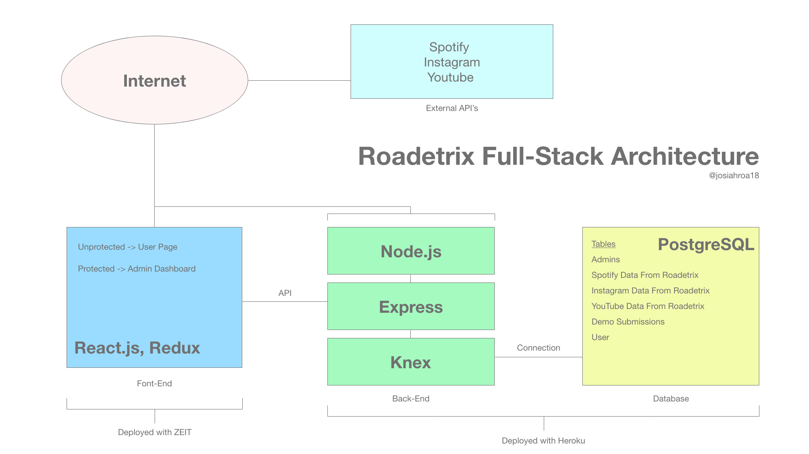

# Roadetrix.com

## About
Roadetrix Records is a lorem ipsum lorem ipsum lorem ipsum lorem ipsum
lorem ipsum lorem ipsum lorem ipsum lorem ipsum lorem ipsum

## Tech Stack
- React.js
- Node.js
- Express
- PostgreSQL

## Architecture

## Dependencies
| Dependency | URL                                 |
|------------|-------------------------------------|
|   axios    | asdfasdfasdfasdfasdfasdfasf         |

## Getting Started
To get the site running locally:
- Clone this repo
- npm install to install all required dependencies
- npm run dev to run the development environment on your system

Note: Data and some functionality will be missing if [roadetrixBackend](https://github.com/Roadetrix-Records/Back-End) is not also running locally on your system.